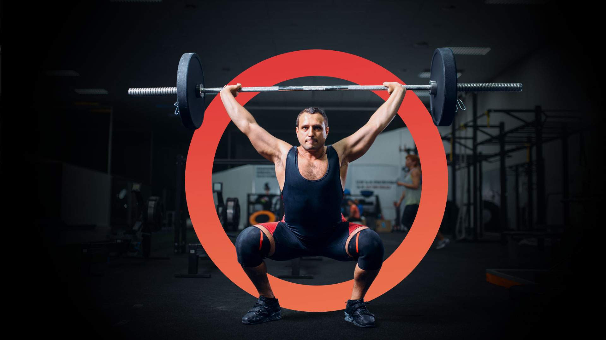

# XtremeFitness

This is the assignment for Svendeprøve by Sebastian Køster

- Repository: https://github.com/rts-cmk/svendepr-ve-a-wu14-kosterseb
- Project board: https://github.com/orgs/rts-cmk/projects/9/views/1




## 1. Running the project

```bash
npm install      #first time
npm install --prefix xtreme-fitness-app
npm install --prefix xtreme-fitness-api
npm run dev
```

| | |
| --- | --- |
| Site | http://localhost:3000 |
| API | http://localhost:4000 |

**Test user:** 


## 2. Tech stack

| | |
| --- | --- |
| Framework | Next.js 16.3.0 (App Router, React 19.2.8) |
| Language | TypeScript 5.9 |
| Styling | Tailwind CSS 4.3 |
| Validation | Zod 4.4 |
| Quality | ESLint 9, Prettier 3.9 |
| API | json-server 0.17 + json-server-auth + json-server-relationship |

---